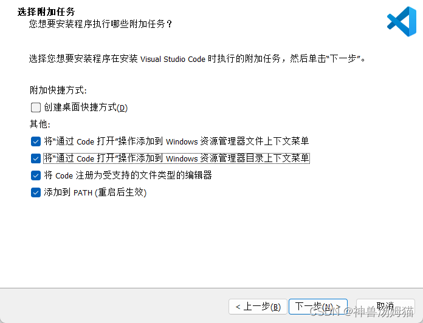

# think-exception
exception for ThinkPHP 
## 安装
`composer require yangweijie/think-exception`

.env 里 app_debug=true

将 app.show_error_msg  设为 true

~~~
// 显示错误信息
'show_error_msg'   => true,
~~~

## 配置设置 exception.php里 editor

~~~
 // 当前编辑器
'editor' => 'vscode',
~~~

## 编辑器协议绑定

### vscode

最容易的，只需要安装时 选择下图的“将code注册为受支持的文件类型的编辑器”就行

### sublime

需要安装 [subl-protocol](https://github.com/thecotne/subl-protocol) 插件

### phpstorm

参考 [laravel-debugbar 中正确使用 ide phpstorm打开项目文件的方式
](https://learnku.com/articles/77072) 文章放置js 和 添加注册表即可

### 其他 
欢迎大家测试，反馈

另外如果是tp8 项目，可以直接使用 [think-ignition](https://github.com/yangweijie/think-ignition) 本人移植 laravel 的ignition 扩展来实现异常显示和跳转
